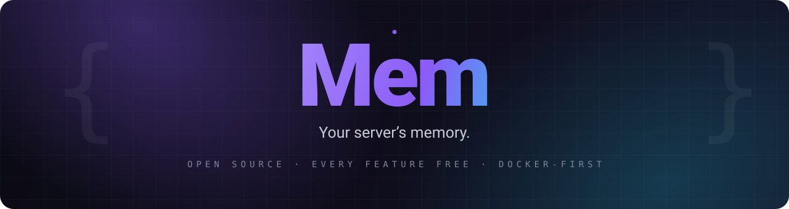
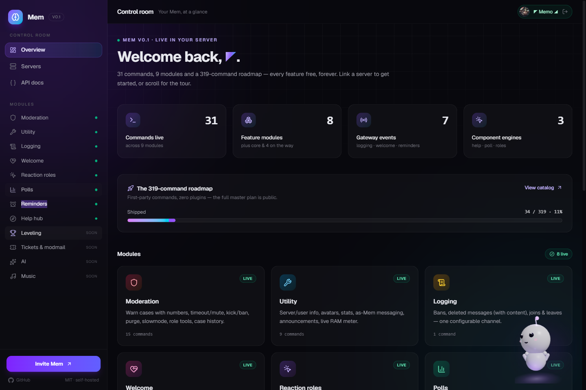
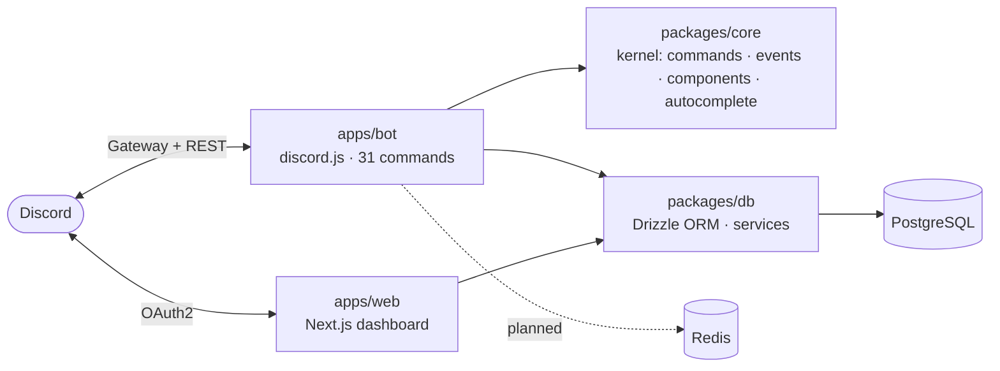

<div align="center">
  
</div>

<div align="center">

### 🧠 One bot to replace them all.

Moderation · Logging · Welcome · Reaction roles · Polls · Reminders · Help hub — **every feature free, forever.**

[](./LICENSE)
[](#-architecture)
[](#-architecture)
[](./apps/web)
[](./docker-compose.yml)
[](#-contributing)

</div>

---

## ✨ What is Mem?

Mem is a **community-management Discord bot with an integrated web dashboard**, built to be the one bot your server actually needs — without the paywall nonsense.

The big incumbents charge for their best features. Mem's entire model is the opposite:

- 🆓 **Everything free. Forever.** No premium tiers. No paywalled "core". No XP held hostage.
- 🧩 **Modular architecture.** A tiny kernel (commands + events + buttons/selects/modals + autocomplete) with self-contained feature modules.
- 🖥️ **A real dashboard.** Discord OAuth login, your server list, module configuration — a proper Next.js control room, not a crippled afterthought.
- 🐳 **Docker-first.** One command to run the whole stack — on your laptop, a VPS, anywhere.
- 🪶 **Light on RAM.** Cache-disciplined by design (message/presence caches off, member caches capped) — check `/botinfo` for the live number.
- ⚡ **Built in a day.** 30+ commits, one developer (and one relentless AI agent), full test coverage of every shipped feature.

## 🚀 Shipped (v0.1) — 35 commands · 12 modules

| Module | What you get today |
|---|---|
| 🛡️ **Moderation** | Warn cases with case numbers, timeout/mute, kick, ban, unban, purge with filters, slowmode, role add/remove, case lookup, pin |
| 🧰 **Utility** | Server/user info, avatars, member count, server icon & stats, **live RAM meter**, as-Mem messaging, announcements |
| 📋 **Logging** | Bans & unbans, deleted messages (content included), member joins/leaves → one configurable channel |
| 👋 **Welcome** | Branded welcome cards with avatar, custom templates `{user} {server} {count}`, live preview |
| 🎭 **Reaction roles** | Select-menu role panels — click to toggle, live repaint, hierarchy-safe |
| 📊 **Polls** | Modal creation (2–10 options), live bar results, multi-select, auto-close with visible timers |
| ⏰ **Reminders** | Natural durations (`10m`, `1h30m`, `2d`), channel→DM fallback, autocomplete picker |
| 🧭 **Help hub** | Type-to-search across every command, category browsing, pagination |
| 🏓 **Core** | Ping, of course |

## 🖥️ Dashboard

<div align="center">
  
</div>

- Sign in with Discord (OAuth2, `identify` + `guilds`)
- **Your servers** — Mem lists every server you can manage (verified against live guild permissions)
- Session-backed API (`/api/guilds`) — the frontend and automation share one source of truth
- **Public API v1** (`/api/v1`) — Bearer-key access to cases, giveaways, polls and warnings; create keys with `/apikey create`, docs at `/docs/api`
- **Memi** — a 3D VTuber-style companion (VRoid VRM avatar + NVIDIA NIM brain) who floats in the dashboard, chats, and walks you to any page
- Per-server module pages are next on the roadmap

> **🆓 Free hosting guide:** [docs/HOSTING.md](docs/HOSTING.md) — run the whole stack (bot + dashboard + Postgres + Redis) on **Oracle Cloud's Always Free tier** or **Northflank's** always-on sandbox. Zero cost, forever.

## ⚡ Quick start

```bash
# 1) Code
git clone https://github.com/Wassuplol/mem.git
cd mem

# 2) Configure — Discord token, client id + secret, auth secret
cp .env.example .env

# 3) PostgreSQL + Redis
pnpm infra:up

# 4) Install + migrate
pnpm install
pnpm --filter @mem/db exec drizzle-kit migrate

# 5) Run
pnpm dev:bot                        # the bot
pnpm --filter @mem/web dev          # dashboard at http://localhost:3000
```

**Requirements:** Node.js 22+ · pnpm 10+ · Docker.

**Discord setup:** create an app in the [Developer Portal](https://discord.com/developers/applications), copy the token + client id/secret into `.env`, invite the bot with the `bot` + `applications.commands` scopes. Want welcome cards and join logs? Toggle **Server Members Intent** on (and set `ENABLE_MEMBERS_INTENT=1`). Same idea for the **Message Content** intent (`ENABLE_MESSAGE_CONTENT=1`).

## 🏗️ Architecture



- **`packages/core`** — the kernel: module manifests, registries, typed interaction contracts. A module ships commands, gateway events, and UI component handlers (matched by `customId` prefix — see the `help:`, `poll:` and `rrole:` reference patterns in-tree).
- **`packages/db`** — schema + services shared by bot, dashboard, and scripts. Migrations via drizzle-kit, smoke-tested against live Postgres.
- **`apps/bot`** — the Discord bot. RAM-conscious caches, lazy scans, no timers you don't need.
- **`apps/web`** — the dashboard: Better Auth, Discord OAuth, session API, server browser.

## 🗺️ Roadmap

The full master plan is public: **[docs/COMMAND-CATALOG.md](docs/COMMAND-CATALOG.md)** — 319 first-party commands, zero plugins, with the Discord-slot math to prove it fits.

| Wave | Contents |
|---|---|
| ✅ **v0.1** | Kernel, 31 commands, dashboard auth + server list, everything above |
| 🚧 **v0.2** | Scheduler engine (tempban, temp roles, countdowns), leveling, tickets |
| 🔜 **v0.3** | Automod + anti-nuke, feeds (YouTube/Twitch/RSS), fun pack, AI module (bring-your-own endpoint) |
| 💡 **v1.0** | 300+ commands, importers (MEE6/Carl/Dyno), music, searchable-everything |

## 🤝 Contributing

Issues and PRs are welcome. The bar: strict TypeScript, tests for behavior, keep the kernel small.

```bash
pnpm typecheck   # all packages
pnpm test        # vitest
```

## 📜 License

**MIT** — use it, fork it, self-host it, ship it. The Mem name and logo stay with the project.

<div align="center">

---

*Built overnight by an AI agent and one very ambitious human.* 🧠

</div>
